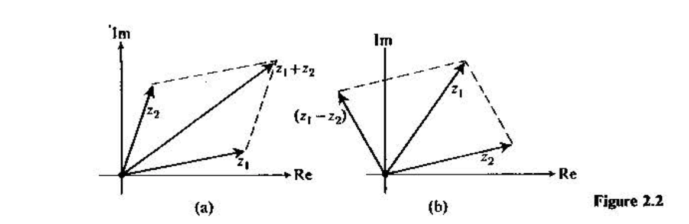

# Complex arithmetic and geometry

Cartesian and polar forms connect complex arithmetic with plane geometry, rotations, dot products, and cross products.

## Exercises

### Complex numbers

::: {#exr-complex-arithmetic-compute-real-imaginary-parts-functions }

Let $z = x + \mathrm{i}y \in \mathbb{C}$, and compute the real and imaginary parts of $z^2$, $z^3$, and $z^4$, as functions of $x$ and $y$.

:::

:::{#exr-complex-arithmetic-compute-closed-form-expression-real-imaginary}

Compute a closed-form expression for the real and imaginary parts of $z^n$.

:::

:::{#exr-complex-arithmetic-compute-closed-form-expression-exhibiting-real}

Compute closed-form expression for $z^{-1}$, exhibiting the real and imaginary parts as functions of $x$ and $y$. (Assuming $z\neq 0$). Try to compute closed-form expressions of $z^{-2}$ and $z^n$ as well.

:::

::: {#exr-complex-arithmetic-complex-numbers-can-written-polar-form  level="intermediate"}

A complex number $z = x + \mathrm{i}y$ can be written in polar form, $$x = r \cos(\theta), \quad y = r \sin(\theta).$$ Write down the rule for $z^n = R\cos \phi + \mathrm{i}R\sin\phi$ using angle $\theta$ and modulus $r$.

:::

:::{#exr-complex-arithmetic-consider-polynomial-equation-find-all-roots}

Consider the polynomial equation $f(z) = z^3 + 1 = 0$. Find all the roots in the complex plane using polar coordinates. Sketch the roots in a coordinate system.

:::

### Basic calculations

{#fig-parallelogram-rule width="75%"}

::: {#exr-complex-arithmetic-illustrate-addition-coordinate-system-parallelogram-rule level="intermediate"}

Let $z = x + \mathrm{i}y \in \mathbb{C}$. Illustrate the addition $w = z + \bar{z}$ in a coordinate system using the parallelogram rule.

:::

:::{#exr-complex-arithmetic-recall-our-earlier-exercise-where-was}

Recall our earlier exercise, where $\mathbb{C}$ was regarded as the real vector space $\mathbb{R}^2$. Let $z_i= x_i + \mathrm{i}y_i$, and denote the corresponding vectors in $\mathbb{R}^2$ by $\mathbf{v}_i$. Show that $$\left\langle\mathbf{v}_1,\mathbf{v}_2\right\rangle = \Re (\overline{z_1} z_2) = \Re (z_1 \overline{z}_2).$$

:::

:::{#exr-complex-arithmetic-another-product-indeed-cross-product-matrix}

Another product in $\mathbb{R}^2$ (and indeed $\mathbb{R}^3$) is the *cross product*: $$\mathbf{v}_1\times \mathbf{v}_2 = \begin{vmatrix} v_{11} & v_{12} \\ v_{21} & v_{22} \end{vmatrix},$$ the matrix determinant. Show that $$\mathbf{v}_1 \times \mathbf{v}_2 = \Im (\overline{z_1} z_2) = -\Im (z_1 \overline{z}_2).$$

:::

:::{#exr-complex-arithmetic-function-counterclockwise-rotation-find-function-performs}

Show that the function $z \mapsto \mathrm{i}z$ is a counterclockwise rotation by $\pi/2$. Find the function that performs a clockwise rotation by the same angle.

:::

::: {.content-visible when-profile="tutor"}

## Solutions

### Solution to @exr-complex-arithmetic-compute-real-imaginary-parts-functions {.unnumbered}

$$(x + \mathrm{i}y)^2 = x^2 + 2\mathrm{i}xy + \mathrm{i}^2 y^2 = (x^2 - y^2) + 2\mathrm{i}xy.$$ Obtain the next powers by multiplying the preceding result by $z$.

### Solution to @exr-complex-arithmetic-compute-closed-form-expression-real-imaginary {.unnumbered}

The binomial expansion gives $$(x + \mathrm{i}y)^n = \sum_{j=0}^n \binom{n}{j} x^{n-j} (\mathrm{i}y)^j.$$ Even powers satisfy $\mathrm{i}^{2k}=(-1)^k$. The even indices between $0$ and $n$ are $2j$ for $j=0,1,\ldots,\lfloor n/2\rfloor$, while the odd indices are $2j+1$ for $j=0,1,\ldots,\lfloor(n-1)/2\rfloor$. Let $K=\lfloor n/2\rfloor$ and $L=\lfloor(n-1)/2\rfloor$.

Splitting into even and odd terms gives

$$
(x + \mathrm{i}y)^{n}
= \sum_{j=0}^{K} (-1)^j \binom{n}{2j} x^{n-2j} y^{2j}
+ \mathrm{i}\sum_{j=0}^{L} (-1)^j\binom{n}{2j+1} x^{n-2j-1} y^{2j+1}.
$$

### Solution to @exr-complex-arithmetic-compute-closed-form-expression-exhibiting-real {.unnumbered}

Multiply by the complex conjugate:

$$
z^{-1}=\frac{1}{x+\mathrm{i}y}
=\frac{x-\mathrm{i}y}{(x+\mathrm{i}y)(x-\mathrm{i}y)}
=\frac{x-\mathrm{i}y}{x^2+y^2}.
$$

The formulas from the previous exercise then apply with $y\mapsto-y$ and a prefactor $(x^2+y^2)^{-n}$.

### Solution to @exr-complex-arithmetic-complex-numbers-can-written-polar-form {.unnumbered}

The geometric interpretation gives $\phi = n\theta$ (modulus $2\pi$) and $R = r^n$.

### Solution to @exr-complex-arithmetic-consider-polynomial-equation-find-all-roots {.unnumbered}

$-1$ has modulus 1 and angle $\pi$. A root must be such that $r^n = 1$ (which implies $r=1$), and $3\theta = \pi + 2k\pi$, since the angle wraps around at $2\pi$ when we multiply complex numbers. Thus, $\theta = \pi/3 + 2k\pi/3$. $k=0$ gives $\pi/3$, $k=1$ gives $3\pi/3=\pi$, and $k=2$ gives $5\pi/3$. Now any larger $k$ wraps around to these three angles. So we have found the roots.

### Solution to @exr-complex-arithmetic-illustrate-addition-coordinate-system-parallelogram-rule {.unnumbered}

*The source does not supply a solution.*

### Solution to @exr-complex-arithmetic-recall-our-earlier-exercise-where-was {.unnumbered}

*The source does not supply a solution.*

### Solution to @exr-complex-arithmetic-another-product-indeed-cross-product-matrix {.unnumbered}

*The source does not supply a solution.*

### Solution to @exr-complex-arithmetic-function-counterclockwise-rotation-find-function-performs {.unnumbered}

*The source does not supply a solution.*

:::
