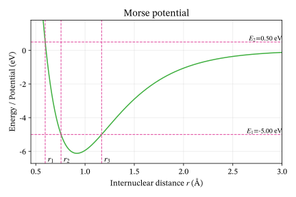

# Sets and functions

Sets and set notation appear many places in quantum chemistry. The goal of this chapter is to train you in the basic usage of sets and set notation.

## Exercises: abstract sets and functions

::: {#exr-sets-and-functions-write-days-week-set recommended="math" level="beginner"}
### Days of the week as a set

The days of the week form a simple example of a finite set. Recall that we write the elements of a set inside braces, such as

$$
A=\{a,b,c\}.
$$

a.	Write the days of the week as a set $D$ using braces $\{\ \}$.

b.	How many elements does $D$ contain? Write your answer using the notation $|D|$ for the number of elements in a set.

c.	Is Monday an element of $D$? Write your answer using the symbol $\in$.

d.	Is January an element of $D$? Write your answer using the symbol $\notin$.

e.	Let $W$ be the set consisting of Saturday and Sunday. Write $W$ using braces. Is $W$ a subset of $D$? Express your answer using the symbol $\subseteq$.

f.	Let

	$$
	M=\{\text{Monday},\text{Tuesday},\text{Wednesday},\text{Thursday},\text{Friday}\}.
	$$

	What is $M\cup W$? What is $M\cap W$?

g.	Suppose another student writes the days in a different order,

	$$
	D'=\{\text{Sunday},\text{Saturday},\text{Friday},\text{Thursday},\text{Wednesday},\text{Tuesday},\text{Monday}\}.
	$$

	Is $D'=D$? 
:::

:::{#exr-sets-and-functions-ordered-pair-two-element-set-where}
### Ordered pair

An *ordered pair* $(x,y)$ is a two-element "set" where the order matters. Two ordered pairs $(x,y)$ and $(u,v)$ are equal if and only if $x=u$ and $y = v$. From this it follows that $(x,y) = (y,x)$ if and only if $x=y$. A definition of an ordered pair as a *set* is $$(x,y) = \{ \{x\}, \{x,y\} \}.$$ Show that $(x,y) = (y,x)$ if and only if $x=y$ using the set theoretic definition.

:::

:::{#exr-sets-and-functions-nonnegative-rational-number-can-written-ordered}
### Rational numbers as ordered pairs

A nonnegative rational number $p/q$, $p,q\in\mathbb{N}$, $q > 0$, can be written as an ordered pair $(p,q)$. Write down the rational numbers $1/4$, $2/3$, $0$, $1/3$ as ordered pairs using set theory, both for the pair and for each integer. (Strictly speaking we the number itself is an *equivalence class* of such pairs, i.e., $pn/qn = p/q$, so we must identify $(p,q)$ and $(np,nq)$. Ignore equivalence classes in this exercise.)

:::

:::{#exr-sets-and-functions-cartesian-product-two-sets-write-down}
### Cartesian product of two sets

The *cartesian product* of two sets $A$ and $B$ is $$A \times B = \{ (a,b) \mid a\in A, \; b\in B\}.$$ Write down the cartesian product of $\{\heartsuit,\diamondsuit,\spadesuit,\clubsuit\}$ and $\{1,2,3\}$, using the set theoretic definition for the ordered pair. You can skip spelling out the set theoretic definition of the natural numbers.

:::

:::{#exr-sets-and-functions-similar-previous-exercise-write-down}
### Ordered pair as a two-element set

Similar to the previous exercise, write down $\{1,2,3\} \times \{2,3,4\}$.

:::

:::{#exr-sets-and-functions-function-one-set-another-set-rule}
### Function from one set to another set

A *function* $f: A \to B$ from one set $A$ to another set $B$ is a rule that assigns to every $a\in A$ precisely one $b\in B$. In terms of set theory, a function $f:A\to B$ is a subset of $A\times B$, such that

- For all $a\in A$ there exists $b\in B$ such that $(a,b)\in f$.

- For all $a \in A$ and $b,b'\in B$, if $(a,b)\in f$ and $(a,b')\in f$, then $b=b'$.

Write down the function $f:\{1,2,3\} \to \{1,2,3\}$, $f(1) = 2$, $f(2)=3$, $f(3)=1$, using the set theoretic definition of ordered pairs and the cartesian product.

:::

De Morgan's laws are useful when discussing subsets $A,B$ of a larger set $X$. Recall that the complement of $A$ relative to $X$ is $A^\complement = X \setminus A$. De Morgan's laws state that:

- $(A \cup B)^\complement = A^\complement \cap B^\complement$.

- $(A \cap B)^\complement = A^\complement \cup B^\complement$.

::: {#exr-sets-and-functions-draw-picture-representing-whole-sheet-overlapping recommended="math" level="intermediate"}
### De Morgan's laws

Draw a picture, representing $X$ as the whole sheet, $A$ and $B$ as overlapping shapes, e.g., circles. Label $A$, $B$, $A\cap B$, and $A \cup B$, making another drawing if necessary. Convince yourself that De Morgan's laws are correct.

:::

:::{#exr-sets-and-functions-prove-de-morgan-s-laws-mathematically}
### De Morgan's laws 2

Prove De Morgan's laws mathematically. Note that the complement operation acts like negation of truth, i.e., $a \in A^\complement$ if and only if $a \in X$ and $a \notin A$.

:::

## Exercises: Sets in quantum chemistry

{#fig-morse-potential}

::: {#exr-sets-potential-energy-curve recommended="math" level="beginner"}
### Classically allowed region for Morse potential 

Figure @fig-morse-potential shows the _Morse potential_ - a common model potential for vibrational motion of a diatomic molecule: 

$$
    V(r) = D_e \left( 1 - e^{-a(r-r_e)} \right)^2 - D_e,
$$

where $D_e>0$ is the dissociation energy, $r_e>0$ is the equilibrium bond length, and $a>0$ is a parameter that determines the width of the potential well. The total energy of the molecule is denoted by $E \in \mathbb{R}$. The classically allowed region for the total energy $E$ is the set $S_E$ of all bond lengths $r$ such that $V(r) \leq E$:

$$
S_E = \{ r \in \mathbb{R} \mid V(r) \leq E \}
$$ 

a. Explain the notation $S_E = \{ r \in \mathbb{R} \mid V(r) \leq E \}$ in words. In particular, what does the vertical bar $|$ mean?

b. Can you find a condition on $E$ such that $S_E$ is the empty set?

c. Can you find a condition on $E$ such that $S_E$ is the whole real line?

d. Based on the figure, which of the following statements are true?

    - $S_{E_1} = (r_2,r_3)$
    - $S_{E_1} = [r_2,r_3]$
    - $S_{E_1} = \{ r_2,r_3 \}$
  
e. Based on the figure, which of the following statements are true?

    - $S_{E_2} = (r_1,+\infty)$
    - $S_{E_2} = [r_1,+\infty)$
    - $S_{E_2} = \{ r_1,r_2, r_3 \}$
:::

::: {#exr-molecule-sets recommended="math" level="intermediate"}
### Molecules as sets

In this exercise, a *molecule* is informally defined only by its chemical composition: the number of atoms of each element occurring in its molecular formula. Thus, $\mathrm{H_2}$ and $\mathrm{CO}$ are two distinct molecules, while $\mathrm{HCOOH}$ and $\mathrm{CO_2H_2}$ represent the same molecule, since both contain one C atom, two H atoms, and two O atoms.

We ignore molecular geometry, bonding, isotopes, charge, and all questions of chemical stability. In particular, any formal combination of atoms is deemed a molecule, whether or not such a species could exist physically.

We restrict our attention to the four elements C, H, O, and N. Let $M$ denote the set of all molecules that can be constructed from these elements. A molecule must contain at least one atom.

One useful way of describing a molecule is by the ordered quadruple

$$
(n_{\mathrm C},n_{\mathrm H},n_{\mathrm O},n_{\mathrm N}),
$$ {#eq-ordered-tuple-molecule}

where each $n_X$ is the number of atoms of element $X$ in the molecule. For example,

$$
\mathrm{CH_4}\longleftrightarrow (1,4,0,0),
$$

and

$$
\mathrm{N_2O}\longleftrightarrow (0,0,1,2).
$$

a. Explain why @eq-ordered-tuple-molecule uniquely determines an element of $M$. Give 4-5 additional examples of molecules in terms of this representation.

b. Express $M$ in terms of $\mathbb N_0=\{0,1,2,\ldots\}$. What is the cardinality of $M$? Is it finite, countably infinite, or uncountably infinite? Justify your answer.

b. Let

    $$
    M_2=\{m\in M\mid m\text{ contains exactly two atoms}\}.
    $$

    Find $|M_2|$ and list all elements of $M_2$.

c. Let $S\subset M$ be the set

    $$
    S=\left\{m\in M\mid m\text{ contains at least one H atom}\right\}.
    $$

    Describe $S$ in terms of the quadruple representation above. Is $S$ finite, countably infinite, or uncountably infinite? Justify your answer.

    d. Describe the complement $M\setminus S$. What is its cardinality?

e. Define

    $$
    C=\left\{m\in M\mid m\text{ contains at least one C atom}\right\}.
    $$

    Describe the following sets both in words and in terms of the quadruple representation:

    $$
    C\cap S,\qquad C\cup S,\qquad C\setminus S.
    $$

    Determine the cardinality of each set.

f. For $n\geq 1$, define

    $$
    M_n=\left\{m\in M\mid m\text{ contains exactly }n\text{ atoms}\right\}.
    $$

    Thus, a molecule in $M_n$ satisfies

    $$
    n_{\mathrm C}+n_{\mathrm H}+n_{\mathrm O}+n_{\mathrm N}=n.
    $$

    Show that

    $$
    |M_n|=\binom{n+3}{3}.
    $$

    Check that your formula agrees with your answer to part **b**.

g. Explain why

    $$
    M=\bigcup_{n=1}^{\infty}M_n.
    $$

    Are the sets $M_n$ pairwise disjoint? Use this decomposition to give another argument that $M$ is countably infinite.

h. Show that $M$ and $S$ have the same cardinality. Explain why this is possible even though $S$ is a proper subset of $M$.

:::

::: {.content-visible when-profile="tutor"}

## Solutions {.unnumbered}

### Solution for @exr-sets-and-functions-write-days-week-set {.unnumbered}

a.	The set of days of the week is

	$$
	D=\{\text{Monday},\text{Tuesday},\text{Wednesday},\text{Thursday},\text{Friday},\text{Saturday},\text{Sunday}\}.
	$$

b.	There are seven elements in $D$, so

	$$
	|D|=7.
	$$

c.	Monday is an element of $D$. We write

	$$
	\text{Monday}\in D.
	$$

d.	January is not an element of $D$. We write

	$$
	\text{January}\notin D.
	$$

e.	The set containing Saturday and Sunday is

	$$
	W=\{\text{Saturday},\text{Sunday}\}.
	$$

	Every element of $W$ is also an element of $D$. Therefore $W$ is a subset of $D$:

	$$
	W\subseteq D.
	$$

f.	The set $M$ contains the weekdays and $W$ contains Saturday and Sunday. Their union therefore contains all days of the week:

	$$
	M\cup W=D.
	$$

	There are no elements belonging to both $M$ and $W$, so their intersection is the empty set:

	$$
	M\cap W=\varnothing.
	$$

g.	Yes,

	$$
	D'=D.
	$$

	The order in which we write the elements of a set does not matter. Two sets are equal if they contain exactly the same elements. Thus, for example,

	$$
	\{\text{Monday},\text{Tuesday}\}
	=
	\{\text{Tuesday},\text{Monday}\}.
	$$

### Solution to @exr-sets-and-functions-ordered-pair-two-element-set-where {.unnumbered}

*The source does not supply a solution.*

### Solution to @exr-sets-and-functions-nonnegative-rational-number-can-written-ordered {.unnumbered}

*The source does not supply a solution.*

### Solution to @exr-sets-and-functions-cartesian-product-two-sets-write-down {.unnumbered}

*The source does not supply a solution.*

### Solution to @exr-sets-and-functions-similar-previous-exercise-write-down {.unnumbered}

*The source does not supply a solution.*

### Solution to @exr-sets-and-functions-function-one-set-another-set-rule {.unnumbered}

*The source does not supply a solution.*

### Solution to @exr-sets-and-functions-draw-picture-representing-whole-sheet-overlapping {.unnumbered}

*The source does not supply a solution.*

### Solution to @exr-sets-and-functions-prove-de-morgan-s-laws-mathematically {.unnumbered}

Here is the proof of the first one: $x \in (A \cup B)^\complement$ iff $x \notin A \cup B$ iff $x\notin A$ and $x \notin B$ iff $x \in A^\complement$ and $x \in B^\complement$ iff $x \in A^\complement \cap B^\complement$.

### Solution to @exr-sets-potential-energy-curve {.unnumbered}

a. The notation

$$
S_E = \{ r \in \mathbb{R} \mid V(r) \leq E \}
$$

means that $S_E$ is the set of all real numbers $r$ for which the potential energy $V(r)$ is less than or equal to the total energy $E$.

The vertical bar $|$ means **such that**. Thus, the expression can be read as

> the set of all $r$ in the real numbers such that $V(r)\leq E$.

b. The Morse potential has its minimum at the equilibrium bond length $r=r_e$. At this point,

$$
V(r_e)
=
D_e(1-e^0)^2-D_e
=
-D_e.
$$

Therefore,

$$
V(r)\geq -D_e
$$

for all $r$. If

$$
E<-D_e,
$$

there are no values of $r$ for which $V(r)\leq E$. Hence,

$$
\boxed{S_E=\varnothing \quad\text{if}\quad E<-D_e.}
$$

Notice that when $E=-D_e$, the set is not empty; it contains exactly the equilibrium bond length:

$$
S_{-D_e}=\{r_e\}.
$$

c. There is no finite value of $E$ for which $S_E$ is the whole real line.

To see this, consider the limit as $r\to-\infty$. Since $a>0$,

$$
e^{-a(r-r_e)}\to+\infty,
$$

and therefore

$$
V(r)\to+\infty.
$$

Thus, for any finite $E\in\mathbb R$, there are sufficiently negative values of $r$ for which

$$
V(r)>E.
$$

Consequently,

$$
\boxed{S_E\neq\mathbb R\quad\text{for every finite }E\in\mathbb R.}
$$

d. At energy $E_1$, the horizontal energy line intersects the potential at the two turning points $r_2$ and $r_3$. Between these points,

$$
V(r)\leq E_1.
$$

The endpoints themselves are included because

$$
V(r_2)=V(r_3)=E_1
$$

and the definition uses $\leq$, rather than $<$.

Therefore,

$$
\boxed{S_{E_1}=[r_2,r_3].}
$$

Hence the statements have truth values

- $S_{E_1}=(r_2,r_3)$: **false**
- $S_{E_1}=[r_2,r_3]$: **true**
- $S_{E_1}=\{r_2,r_3\}$: **false**

e. At energy $E_2$, the potential first becomes less than or equal to $E_2$ at $r=r_1$. For all larger $r$, the potential remains below or equal to $E_2$.

Again, the point $r_1$ itself is included because

$$
V(r_1)=E_2.
$$

Therefore,

$$
\boxed{S_{E_2}=[r_1,+\infty).}
$$

Hence the statements have truth values

- $S_{E_2}=(r_1,+\infty)$: **false**
- $S_{E_2}=[r_1,+\infty)$: **true**
- $S_{E_2}=\{r_1,r_2,r_3\}$: **false**

### Solution to @exr-molecule-sets {.unnumbered}

a. A molecule is uniquely determined by an ordered quadruple

$$
(n_{\mathrm C},n_{\mathrm H},n_{\mathrm O},n_{\mathrm N}),
$$

where each entry is a non-negative integer and not all four entries are zero. Hence

$$
M=\mathbb N_0^4\setminus\{(0,0,0,0)\}.
$$

Since $\mathbb N_0$ is countably infinite, any finite Cartesian product of copies of $\mathbb N_0$ is also countably infinite. Removing one element does not change the cardinality. Therefore

$$
|M|=\aleph_0,
$$

so $M$ is **countably infinite**.

b. A diatomic molecule corresponds to a non-negative integer solution of

$$
n_{\mathrm C}+n_{\mathrm H}+n_{\mathrm O}+n_{\mathrm N}=2.
$$

The possibilities are

$$
\mathrm{C_2},\quad
\mathrm{H_2},\quad
\mathrm{O_2},\quad
\mathrm{N_2},\quad
\mathrm{CH},\quad
\mathrm{CO},\quad
\mathrm{CN},\quad
\mathrm{HO},\quad
\mathrm{HN},\quad
\mathrm{ON}.
$$

Hence

$$
|M_2|=10.
$$

c. In the quadruple representation,

$$
S=
\left\{
(n_{\mathrm C},n_{\mathrm H},n_{\mathrm O},n_{\mathrm N})
\in\mathbb N_0^4
\mid n_{\mathrm H}\geq 1
\right\}.
$$

The set $S$ is infinite, since it contains

$$
\mathrm H,\mathrm{H_2},\mathrm{H_3},\ldots
$$

It is also a subset of the countable set $M$. Therefore

$$
|S|=\aleph_0,
$$

so $S$ is countably infinite.

d. The complement consists of all molecules containing no hydrogen:

$$
M\setminus S=
\left\{
(n_{\mathrm C},0,n_{\mathrm O},n_{\mathrm N})
\mid
n_{\mathrm C},n_{\mathrm O},n_{\mathrm N}\in\mathbb N_0,
\;
n_{\mathrm C}+n_{\mathrm O}+n_{\mathrm N}>0
\right\}.
$$

This set is again countably infinite:

$$
|M\setminus S|=\aleph_0.
$$

e. We have

$$
C=
\left\{
(n_{\mathrm C},n_{\mathrm H},n_{\mathrm O},n_{\mathrm N})
\in M
\mid n_{\mathrm C}\geq 1
\right\}.
$$

The intersection

$$
C\cap S=
\left\{
(n_{\mathrm C},n_{\mathrm H},n_{\mathrm O},n_{\mathrm N})
\in M
\mid n_{\mathrm C}\geq 1,\; n_{\mathrm H}\geq 1
\right\}
$$

consists of molecules containing both carbon and hydrogen.

The union

$$
C\cup S=
\left\{
(n_{\mathrm C},n_{\mathrm H},n_{\mathrm O},n_{\mathrm N})
\in M
\mid n_{\mathrm C}\geq 1
\text{ or }
n_{\mathrm H}\geq 1
\right\}
$$

consists of molecules containing carbon or hydrogen, or both.

Finally,

$$
C\setminus S=
\left\{
(n_{\mathrm C},0,n_{\mathrm O},n_{\mathrm N})
\in M
\mid n_{\mathrm C}\geq 1
\right\}
$$

consists of molecules containing carbon but no hydrogen.

All three sets are infinite subsets of the countable set $M$, and each is easily seen to contain a countably infinite sequence of distinct molecules. Hence

$$
|C\cap S|
=
|C\cup S|
=
|C\setminus S|
=
\aleph_0.
$$

f. The number of elements of $M_n$ is the number of non-negative integer solutions of

$$
n_{\mathrm C}+n_{\mathrm H}+n_{\mathrm O}+n_{\mathrm N}=n.
$$

By the stars-and-bars formula, the number of such solutions is

$$
|M_n|
=
\binom{n+4-1}{4-1}
=
\binom{n+3}{3}.
$$

For $n=2$,

$$
|M_2|
=
\binom{5}{3}
=
10,
$$

in agreement with part **b**.

g. Every molecule contains some finite positive number $n$ of atoms, so it belongs to exactly one set $M_n$. Therefore

$$
M=\bigcup_{n=1}^{\infty}M_n.
$$

The sets $M_n$ are pairwise disjoint, since a molecule cannot contain exactly $n$ atoms and exactly $m$ atoms when $n\neq m$.

Each $M_n$ is finite, since

$$
|M_n|=\binom{n+3}{3}.
$$

Thus $M$ is a countable union of finite sets. Therefore $M$ is countable. Since there are infinitely many molecules, $M$ is countably infinite.

h. From parts **a** and **c**,

$$
|M|=|S|=\aleph_0.
$$

Thus $M$ and $S$ have the same cardinality, even though

$$
S\subsetneq M.
$$

This is possible because $M$ is infinite. Unlike finite sets, an infinite set can have the same cardinality as one of its proper subsets.

For example, enumerate the molecules as

$$
M=\{m_1,m_2,m_3,\ldots\}
$$

and the hydrogen-containing molecules as

$$
S=\{s_1,s_2,s_3,\ldots\}.
$$

Then the map

$$
f:M\to S,\qquad f(m_i)=s_i,
$$

is a bijection. Hence $M$ and $S$ have the same cardinality.

:::
