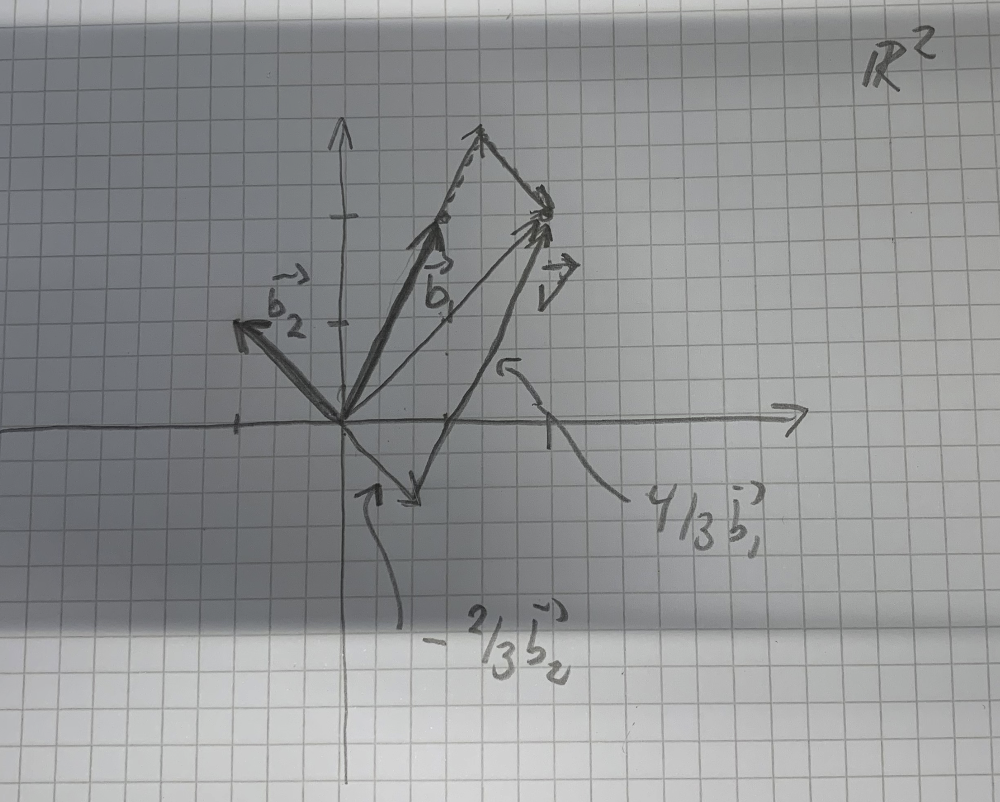

# Vectors and matrices

These exercises connect bases and vector decomposition with matrix multiplication and linear systems.

## Exercises

### Basic vectors

:::{#exr-vectors-and-matrices-work-space-plane-vectors-define-two}

We work in the space $V = \mathbb{R}^2$, plane vectors. We define two vectors, $$
    \mathbf{b}_1 = [1, 2]^T, \quad \mathbf{b}_2 = [-1,1]^T.$$ The superscript $T$ denotes the transpose, so these are column vectors. Show by elementary means that the two vectors are linearly independent. Why do they form a basis for $V$? Make a 2D drawing or plot of them as arrows from the origin.

:::

::: {#exr-vectors-and-matrices-gaussian-elimination-compute-coefficients-such-illustrate recommended="math" level="intermediate"}

Let $\mathbf{v} = [2,2]^T$. Using Gaussian elimination, compute the coefficients $x_1$ and $x_2$ such that $$\mathbf{v} = x_1 \mathbf{b}_1 + x_2 \mathbf{b}_2.$$ Illustrate this decomposition in the graph from the previous point, using the parallelogram rule: The sum of two vectors is obtained by placing the origin of one at the end of the second, or vice versa.

:::

::: {#exr-vectors-and-matrices-person-walks-home-first-they-walk recommended="math" level="intermediate"}

A person walks from home. First, they walk to the subway station. This is 1 km north and 500 m east as the crow flies. The subway takes the person to the city centre, which 3 km east and 2 km south of the subway station, as the crow flies. The person then walks 200 m south and 400 m west to their office.

What are the coordinates of the office, relative to the person's home?

What is the distance to home, as the crow flies?

:::

:::{#exr-vectors-and-matrices-boat-sailing-ocean-at-constant-speed}

A boat is sailing on the ocean, at a constant speed 20 km/h relative to the water surface, in the northeast direction. However, the water surface is moving too, at a constant velocity. After two hours, the boat is located 20 km north and 10 km east of the starting point. What is the speed and direction of ocean drift?

:::

:::{#exr-vectors-and-matrices-robert-beezer-three-digit-number-has}

(Robert Beezer) A three-digit number has two properties. The tens-digit and the ones-digit add up to 5. If the number is written with the digits in the reverse order, and then subtracted from the original number, the result is 792. Use a system of equations to find all of the three-digit numbers with these properties.

:::

### More vectors and matrices

These exercises are to get practice with computing matrix-matrix products, and to get an intuitive feel for them.

::: {#exr-vectors-and-matrices-matrix-products-between-pairs-these-matrices recommended="math" level="intermediate"}

Let $$A = \begin{bmatrix} 1 & 3 \\ 0 & -2 \end{bmatrix}, \quad B = \begin{bmatrix} 7 & -1 & 0 \\ 8 & 1 & -1 \end{bmatrix}, \quad C = \begin{bmatrix} 0 & -1 \\ 5 & 7 \\ 0 & 7 \end{bmatrix}$$ Which matrix products between pairs of these matrices are defined? Compute the products.

:::

::: {#exr-vectors-and-matrices-matrix-defined-zero-otherwise-compute-action recommended="math" level="intermediate"}

Let $A$ be the $n\times n$ matrix defined by $A_{i,i+1} = i^2$ for $1 \leq i < n$, and zero otherwise. Compute the action of $A$ and $A^T$ on the standard basis for $\mathbb{R}^n$. Compute the action of $A$ and $A^T$ on an arbitrary vector $\mathbf{x}\in \mathbb{R}^n$.

:::

:::{#exr-vectors-and-matrices-write-terms-column-vectors-prove-i}

Let $A \in M(n,m,\mathbb{F})$, $B \in M(m,o,\mathbb{F})$. Write $B$ in terms of column vectors, $B = [\mathbf{b}_1,\cdots,\mathbf{b}_o]$. Prove that $$AB = [A\mathbf{b}_1, \cdots, A\mathbf{b}_o],$$ i.e., $A$ acts on each individual column of $B$. Similarly, show that, if we write $A$ in terms of its *row vectors*, $$A = \begin{bmatrix} \mathbf{a}_1^T \\ \mathbf{a}_2^T \\ \cdots \\ \mathbf{a}_n^T \end{bmatrix},$$ then $$AB = \begin{bmatrix} \mathbf{a}_1^T B \\ \mathbf{a}_2^T B \\ \cdots \\ \mathbf{a}_n^T B  \end{bmatrix}.$$

:::

:::{#exr-vectors-and-matrices-columns-linear-combination-columns-coefficients-determined}

Show that each column of $C = AB$ is a linear combination of the columns of $A$ with coefficients determined by $B$, $$\mathbf{c}_i = \sum_j \mathbf{a}_j B_{ji}.$$ Show a similar result for the rows of $C$.

:::

::: {.content-visible when-profile="tutor"}

## Solutions

### Solution to @exr-vectors-and-matrices-work-space-plane-vectors-define-two {.unnumbered}

Suppose we write $\mathbf{b}_1 x_1 + \mathbf{b}_2 x_2 = 0$. We must show that $x_1=x_2 = 0$ is the only solution. By adding the equations, we get $3 x1 = 0$, and then by insertion into the first equation $x_2 = 0$. Since we have 2 linearly independent vectors in $\mathbb{R}^2$, these form a basis.

### Solution to @exr-vectors-and-matrices-gaussian-elimination-compute-coefficients-such-illustrate {.unnumbered}

The equation gives a linear system $$\begin{gathered}
    \begin{bmatrix}
        b_{11} & b_{21} \\ b_{12} & b_{22} 
    \end{bmatrix} \begin{bmatrix} x_1 \\ x_2 \end{bmatrix} = \begin{bmatrix} v_1 \\ v_2 \end{bmatrix}
\end{gathered}$$ where $b_{ij} = (\mathbf{b}_i)_j$. We get an augmented matrix $$\begin{bmatrix} 1 & -1 & 2 \\ 2 & 1 & 2 \end{bmatrix}$$ Multiply row 2 by $-1/2$ $$\begin{bmatrix} 1 & -1 & 2 \\ -1 & -1/2 & -1 \end{bmatrix}$$ Add row 1 to row 2: $$\begin{bmatrix} 1 & -1 & 2 \\ 0 & -3/2 & 1 \end{bmatrix}$$ Divide row 2 by $-3/2$: $$\begin{bmatrix} 1 & -1 & 2 \\ 0 & 1 & -2/3 \end{bmatrix}$$ Add row 2 to row 1: $$\begin{bmatrix} 1 & 0 & 4/3  \\ 0 & 1 & -2/3 \end{bmatrix}$$ This system is equivalent to $$x_1 = 4/3, \quad x_2 = -2/3,$$ which is the solution.

{width="6cm"}

### Solution to @exr-vectors-and-matrices-person-walks-home-first-they-walk {.unnumbered}

The first point is solved by simple vector addition. The second point is by computing the euclidean norm.

### Solution to @exr-vectors-and-matrices-boat-sailing-ocean-at-constant-speed {.unnumbered}

Take east and north as the first and second coordinate directions. The boat's velocity relative to the water is

$$
\mathbf{v}=\frac{20}{\sqrt{2}}[1,1]^T.
$$

Its observed displacement after two hours is $[10,20]^T$, so

$$
2\mathbf{v}+2\mathbf{u}=[10,20]^T,
\qquad
\mathbf{u}=[5-10\sqrt{2},10-10\sqrt{2}]^T\ \text{km/h}.
$$

The drift speed is $\|\mathbf{u}\|$, and its direction follows from
$\operatorname{atan2}(u_2,u_1)$.

### Solution to @exr-vectors-and-matrices-robert-beezer-three-digit-number-has {.unnumbered}

Let $a$ be the hundreds digit, $b$ the tens digit, and $c$ the ones digit. Then the first condition says that $b + c = 5$. The original number is $100a + 10b + c$, while the reversed number is $100c + 10b + a$. So the second condition is $792 = (100a + 10b + c) - (100c + 10b + a) = 99a - 99c$. So we arrive at the system of equations $b + c = 5$, $99a - 99c = 792$. By elementary row operations, we arrive at the equivalent system $a - c = 8$, $b + c = 5$. We can vary $c$ and obtain infinitely many solutions. However, $c$ must be a digit, restricting us to ten values $(0 - 9)$. Furthermore, if $c > 1$, then the first equation forces $a > 9$, an impossibility. Setting $c = 0$, yields $850$ as a solution, and setting $c = 1$ yields $941$ as another solution.

### Solution to @exr-vectors-and-matrices-matrix-products-between-pairs-these-matrices {.unnumbered}

*The source does not supply a solution.*

### Solution to @exr-vectors-and-matrices-matrix-defined-zero-otherwise-compute-action {.unnumbered}

*The source does not supply a solution.*

### Solution to @exr-vectors-and-matrices-write-terms-column-vectors-prove-i {.unnumbered}

*The source does not supply a solution.*

### Solution to @exr-vectors-and-matrices-columns-linear-combination-columns-coefficients-determined {.unnumbered}

*The source does not supply a solution.*

:::
